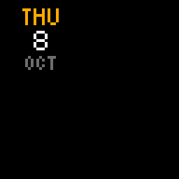
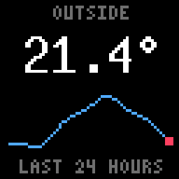

# panel-ddp

A dashboard for an LED matrix. `panel-ddp` draws pages of tiles (a clock,
the weather, sensor readings, charts, tables, album art, pictures) and
streams them to a [WLED](https://kno.wled.ge) panel over the network, ten
frames a second. Nothing is installed on the board: it runs on a Raspberry
Pi or a laptop nearby, and when it stops the board goes back to its own
presets.

| The demo | Charts and tables |
|---|---|
|  |  |

Both are the program's own previews of `demo.yaml` and
`demo-dashboards.yaml`, four times the panel's 64×64 pixels.

## What it does

- **Draws a dashboard from one YAML file.** Layouts are named regions of
  the panel; pages put tiles in them; playlists and a schedule say which
  pages show when (a dim clock at night, say). The file is checked against
  a JSON Schema, by editors as you type and by `panel-ddp check`, and a
  running panel picks up a saved change within a second.
- **Tiles**
  - clock, date, weather (Open-Meteo, no account);
  - Home Assistant sensors and progress bars, and alerts that take over
    the panel;
  - text in thirteen sizes, aligned, scrolling or cut to fit;
  - line, area and bar charts, of a Home Assistant entity's history or of
    values pushed to the panel;
  - tables, rows of any of these, fixed or one for each row of pushed
    data;
  - now playing and album art from Spotify or a Home Assistant media
    player, as a spinning record, a cover or a faint background;
  - a picture frame from a folder.
- **Takes data from other programs.** A small HTTP endpoint accepts a
  chart's values or a table's rows as JSON, so a script can run a database
  query and put the result on the panel with one request.
- **Streams over DDP** (UDP port 4048) to any WLED matrix, 64×64 unless
  the config says otherwise.
- **Previews without the board**: a PNG, or an animated GIF or APNG, of
  any page of any config on made-up data.
- **Runs unattended**: as a systemd service on a Raspberry Pi
  (cross-compiled from a Mac) or a launchd agent on a laptop. Secrets stay
  out of the config, in a file of their own or the environment.

## Quick start

```sh
cargo build --release
cp dashboard.example.yaml dashboard.yaml    # set target, the sources and the pages
target/release/panel-ddp check dashboard.yaml
target/release/panel-ddp preview            # one frame as a PNG
target/release/panel-ddp run                # stream until Ctrl-C; edits apply as you save
```

Without a board, or before writing a config, look at the demos:

```sh
target/release/panel-ddp preview --config demo-dashboards.yaml --out preview.gif
target/release/panel-ddp run --config demo.yaml --target <board> --once
```

## Pushing data to it

```yaml
sources:
  http: {}
tiles:
  power: {kind: line_chart, series: power, dot: "#ffffff"}
```

```sh
curl -X PUT -d '[412, 398, 455, 620]' http://127.0.0.1:4049/series/power
```

[docs/pushing-data.md](docs/pushing-data.md) is the guide for the program
on the other end, or for an agent working in another repository: where the
endpoint is, what it takes, every request and answer, and an example that
pushes a query's results. `charts.example.yaml` and
`tools/push_example.py` are a config and a program that work together.

## Documentation

- [docs/dashboard.md](docs/dashboard.md) — the configuration file, every
  setting and tile kind, installing on a Raspberry Pi or as a background
  service, Spotify, pages and schedules, the demos.
- [docs/charts.md](docs/charts.md) — text, line, area and bar charts and
  tables, with an example of each.
- [docs/designing-dashboards.md](docs/designing-dashboards.md) — laying a
  page out and checking it without the board, written so an agent can be
  pointed at it and asked for a dashboard.
- [docs/pushing-data.md](docs/pushing-data.md) — the HTTP endpoint.
- [docs/ddp.md](docs/ddp.md) — the DDP protocol and what WLED does with
  it.

MIT licensed; see [LICENSE](LICENSE).
