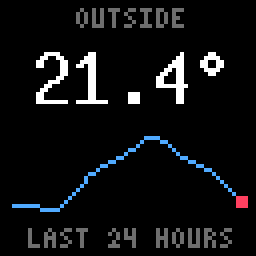

# Text, charts and tables

The tiles for building a dashboard out of numbers: text in thirteen sizes,
line, area, bar and bullet charts, and tables that lay them out in rows. Every
example here is a piece of a config file; [dashboard.md](dashboard.md) has
the file as a whole, and [pushing-data.md](pushing-data.md) how another
program sends the values.

The demos in the repository use all of it:

- `docs/demos/line-charts.yaml`, `area-charts.yaml`, `bar-charts.yaml`,
  `bullet-charts.yaml`, `tables.yaml` and `text.yaml` — dashboards on
  made-up data, a demo for each kind, to look at
  ([demos/README.md](demos/README.md) shows them all):
  `target/release/panel-ddp preview --config docs/demos/line-charts.yaml --all-in-one --out preview.gif`
- `docs/demos/http.yaml` — charts and a table fed over HTTP, to start from.
- `docs/demos/commands.yaml` — the same fed by SQL queries the panel runs.
- `docs/demos/uptime.yaml` — this machine's load, from a script around
  `uptime` (`docs/demos/uptime.sh`).



## Where a chart's values come from

Every chart takes its values from one of three places, and says which:

| Setting | The values are | Needs |
|---|---|---|
| `entity: sensor.x` | the entity's numeric history over the last `hours` (default 24, up to 720), fetched once a minute | `sources.home_assistant` |
| `series: name` | whatever was last pushed to `/series/name`, or printed by a command | `sources.http`, or a command in `sources.commands` |
| `column: name` | that column of the pushed row the chart is on, in a table | a table with `data` |

A bullet chart shows one value, not a run of them: see its own section.

A page can also bring the values itself, for a demo or a fixed picture,
whichever of the three the tile says:

```yaml
pages:
  example:
    layout: one
    tiles: {chart: power}
    data:
      series: {power: [412, 398, 455, 620, 580, 640]}
```

A chart shows all of its values across its width, oldest on the left:
more values than pixels are averaged, fewer are stretched. While it has
none it shows a flat line in the `track` colour.

## Text

```yaml
tiles:
  title: {kind: text, text: "OUTSIDE", size: 4x6}
  value: {kind: text, text: "21.4°", size: 10x20}
  name: {kind: text, text: "CONSERVATORY", size: 4x6, align: left, overflow: truncate}
  amount: {kind: text, text: "1,204", size: 5x8, align: right, colors: {text: "#3cdc5a"}}
```

- `size` is the font, by the width and height of a character in pixels:
  `4x6`, `5x7`, `5x8`, `6x9`, `6x10` (the default), `6x12`, `6x13`, `7x13`,
  `7x14`, `8x13`, `9x15`, `9x18`, `10x20`. A line of *n* characters is
  *n* × the width, less one, pixels wide: `21.4°` at `10x20` is 49.
- `align` is `left`, `center` (the default) or `right`, within the tile's
  region. The line is always centred in the region's height.
- `overflow` says what a line wider than the region does: `scroll` (the
  default, 5 pixels a second, whatever the alignment) or `truncate` (cut to
  the whole characters that fit, then aligned).
- The colour is the `text` role; `colors: {text: "#rrggbb"}` on the tile
  changes it.
- The fonts cover Latin-1 (`°`, `é`, `£`); other characters show as `?`.

`docs/demos/text.yaml` shows every size.

## Line chart

```yaml
tiles:
  plain: {kind: line_chart, entity: sensor.outside_temperature}
  week: {kind: line_chart, entity: sensor.outside_temperature, hours: 168, line: "#50aaff"}
  pushed: {kind: line_chart, series: power, line: "#50aaff", dot: "#ff4060"}
```

- Just the line: no axes, no labels. Its lowest value is on the region's
  bottom row and its highest on the top one.
- `line` is its colour, the `accent` role when left out.
- `dot` puts a three-pixel dot of that colour on the latest value; left
  out, there is none. With a dot, the line keeps a pixel clear of the
  region's edges so the dot fits.
- Text tiles beside it say what it is and what the value is.

## Area chart

```yaml
tiles:
  plain: {kind: area_chart, series: solar}
  own-colour: {kind: area_chart, series: solar, line: "#ffffff", area: "#7030c0"}
  gradient: {kind: area_chart, series: solar, line: "#ffaa00", area: "#ffaa00a0", area_bottom: "#ffaa0000"}
```

A line chart with what is under the line filled, down to the bottom of the
region. It takes everything a line chart does, and:

- `area` is the fill's colour. Left out, it is the line's colour at a
  third of its strength.
- `area_bottom` makes the fill a gradient: `area` on the region's top row,
  `area_bottom` on its bottom row. Colours are `#rrggbbaa`, so an
  `area_bottom` ending in `00` fades the fill out.

## Bar chart

```yaml
tiles:
  plain: {kind: bar_chart, series: rain}
  week: {kind: bar_chart, entity: sensor.rain_today, hours: 168, width: 6, gap: 3, bar: "#2c6cd0", last: "#50aaff"}
  fine: {kind: bar_chart, series: requests, width: 1, gap: 1, last: "#ffffff"}
```

- As many bars as fit: each `width` pixels (default 2), `gap` pixels apart
  (default 1), centred in the region. A 62-pixel region holds 21 bars at
  the defaults, and 7 at `width: 6, gap: 3`. Each bar is the mean of its
  share of the values, so push as many values as there are bars to get one
  bar a value.
- `bar` is the colour, the `accent` role when left out; `last` gives the
  latest bar its own.
- The bottom of the region is zero and the highest value reaches the top,
  so heights compare. With a negative value among them, the bottom is the
  lowest value instead. No bar is under a pixel.
- For values in a narrow band far from zero, a temperature say, a line
  chart shows more.

## Bullet chart

Stephen Few's bullet graph, from *Information Dashboard Design*: one
measure against a target and against what counts as poor, fair and good, in
the space of a single bar. It replaces a gauge or a meter.

```yaml
tiles:
  budget: {kind: bullet_chart, entity: sensor.budget_spent_percent, max: 120, target: 100, ranges: [60, 90]}
  load: {kind: bullet_chart, series: cpu_load, max: 8, target: 4, ranges: [2, 6], bar: "#50aaff"}
  plain: {kind: bullet_chart, entity: sensor.battery_level}
```

- The **bar** runs from the left of the region to the value, a third of
  the region's height, in the `accent` colour or `bar`.
- The **marker** is an upright tick at `target`, taller than the bar, in
  the `text` colour or `marker`. Left out, there is none.
- The **bands** behind them are the qualitative ranges: `ranges` are where
  one ends and the next begins, at most four, so `[60, 90]` makes three
  bands, to 60, to 90 and to `max`. They are one colour (`band`, or the
  `label` role) at falling strength, the first band the strongest, as the
  darkest is in print. Without `ranges` there is one band, the whole scale.
- The **scale** runs from `min` (default 0) at the left to `max` (default
  100) at the right. A value or a target beyond either end stops there.
- The value is one number, not a history: an `entity`'s present state, the
  latest value of a pushed `series`, or a `column` on a table's repeat row.
- It reads from 5 pixels high (a 3-pixel bar, a marker the full height),
  and well at 7 to 9. Put a text tile over or beside it for the name and
  the figure: a bullet chart has no labels of its own.

Bullet charts are at their best stacked in a table, one a row, each value
and target a column of pushed data:

```yaml
sources:
  http: {}

tiles:
  targets:
    kind: table
    data: targets
    gap: 2
    rows:
      - height: 12
        repeat: true
        tiles:
          - {x: 0, y: 0, width: 40, height: 6, tile: {kind: text, column: name, size: 4x6, align: left, overflow: truncate, colors: {text: "#6e6e6e"}}}
          - {x: 42, y: 0, width: 20, height: 6, tile: {kind: text, column: shown, size: 4x6, align: right}}
          - {x: 0, y: 7, width: 62, height: 5, tile: {kind: bullet_chart, column: value, target_column: target, max: 150, ranges: [75, 100]}}
```

```sh
curl -X PUT http://127.0.0.1:4049/tables/targets -d '[
  {"name": "REVENUE", "shown": "112%", "value": 112, "target": 100},
  {"name": "PROFIT",  "shown": "84%",  "value": 84,  "target": 100}
]'
```

- `target_column` takes the target from the row, in place of a fixed
  `target`; `column` and `target_column` are numbers.
- Every row shares the tile's `min`, `max` and `ranges`, so push values on
  one scale: a percentage of plan, as here, compares rows that count
  different things.

## Tables

A table is rows stacked from the top of its region. A row has a `height`
and `tiles`, each placed from the row's top left corner with `x` and
`width`, and optionally `y` (default 0) and `height` (default the rest of
the row). A `tile` is a name from `tiles`, or a tile spelt out; any kind
but another table. `gap` is the pixels between rows.

### Text and a chart on each row

Each row here is a name on the left, a value on the right, and a small
chart between them and the edge: a line chart on two rows, a bar chart on
the third.

```yaml
layouts:
  sheet:
    table: {x: 1, y: 1, width: 62, height: 62}

tiles:
  rooms:
    kind: table
    gap: 1
    colors: {accent: "#50aaff"}
    rows:
      - height: 7
        tiles:
          - {x: 0, width: 27, tile: {kind: text, text: "ROOM", size: 4x6, align: left, colors: {text: "#6e6e6e"}}}
          - {x: 29, width: 19, tile: {kind: text, text: "°C", size: 4x6, align: right, colors: {text: "#6e6e6e"}}}
      - height: 10
        tiles:
          - {x: 0, width: 27, tile: {kind: text, text: "KITCHEN", size: 4x6, align: left, overflow: truncate}}
          - {x: 29, width: 19, tile: {kind: text, text: "22.8", size: 5x8, align: right}}
          - {x: 50, y: 1, width: 12, height: 8, tile: {kind: line_chart, entity: sensor.kitchen_temperature}}
      - height: 10
        tiles:
          - {x: 0, width: 27, tile: {kind: text, text: "OFFICE", size: 4x6, align: left, overflow: truncate}}
          - {x: 29, width: 19, tile: {kind: text, text: "23.1", size: 5x8, align: right}}
          - {x: 50, y: 1, width: 12, height: 8, tile: {kind: line_chart, entity: sensor.office_temperature, dot: "#ffffff"}}
      - height: 10
        tiles:
          - {x: 0, width: 27, tile: {kind: text, text: "RAIN", size: 4x6, align: left}}
          - {x: 29, width: 19, tile: {kind: text, text: "12mm", size: 5x8, align: right}}
          - {x: 50, y: 1, width: 12, height: 8, tile: {kind: bar_chart, series: rain, width: 1, gap: 1}}

pages:
  rooms: {layout: sheet, tiles: {table: rooms}}
```

- The table's own `colors` (and `scheme`) reach every tile on it, under
  each tile's own: here every chart's line is blue without saying so.
- A tile must fit its row and the rows the region; `panel-ddp check` names
  the row and the tile that does not.
- The text in this table is fixed in the config. For text that changes,
  use the next kind.

### Rows from pushed data

With `data`, the table's last row can `repeat`: it is laid out once for
each row pushed to `/tables/NAME`, and its tiles take their values by
`column`. This is the table for a query's results: another program can
push them, or the panel can run the query itself with a command in
`sources.commands` (Data from a command, in [dashboard.md](dashboard.md);
`docs/demos/commands.yaml` does it with SQLite).

```yaml
sources:
  http: {}

tiles:
  services:
    kind: table
    data: services
    gap: 1
    rows:
      - height: 7
        tiles:
          - {x: 0, width: 24, tile: {kind: text, text: "NAME", size: 4x6, align: left, colors: {text: "#6e6e6e"}}}
          - {x: 25, width: 11, tile: {kind: text, text: "MS", size: 4x6, align: right, colors: {text: "#6e6e6e"}}}
      - height: 10
        repeat: true
        tiles:
          - {x: 0, width: 24, tile: {kind: text, column: name, size: 4x6, align: left, overflow: truncate}}
          - {x: 25, width: 11, tile: {kind: text, column: ms, size: 4x6, align: right, overflow: truncate}}
          - {x: 38, y: 1, width: 11, height: 8, tile: {kind: line_chart, column: latency, line: "#50aaff"}}
          - {x: 51, y: 1, width: 11, height: 8, tile: {kind: bar_chart, column: requests, bar: "#3cdc5a", width: 1, gap: 1}}
```

```sh
curl -X PUT http://127.0.0.1:4049/tables/services -d '[
  {"name": "api",    "ms": 42,  "latency": [40, 44, 42, 47], "requests": [30, 41, 38, 52]},
  {"name": "search", "ms": 131, "latency": [120, 140, 131],  "requests": [12, 9, 15, 11]}
]'
```

- A `text` tile on the repeat row takes `column` in place of `text`; a
  chart takes `column` in place of `entity` and `series`, and that column
  is an array of numbers.
- The rows before the repeat row are fixed: a header.
- As many pushed rows show as fit under them: here five, of 10 pixels with
  one between, fill the 54 under the header exactly. The rest are not
  drawn.
- Text shows exactly as pushed, so the program that pushes rounds and
  formats.

[pushing-data.md](pushing-data.md) has the endpoint in full, and
`docs/demos/http.yaml` is this table with three charts beside it.

### Tiles anywhere on a row

`x`, `y`, `width` and `height` place a tile freely on its row, so a row
can hold a name over its value with a tall chart beside them:

```yaml
tiles:
  energy:
    kind: table
    gap: 1
    rows:
      - height: 20
        tiles:
          - {x: 0, y: 1, width: 30, height: 6, tile: {kind: text, text: "SOLAR", size: 4x6, align: left, colors: {text: "#6e6e6e"}}}
          - {x: 0, y: 8, width: 30, height: 12, tile: {kind: text, text: "3.2kW", size: 6x12, align: left}}
          - {x: 32, y: 1, width: 30, height: 18, tile: {kind: area_chart, series: solar, area_bottom: "#ffaa0000"}}
```

## Seeing it without the panel

```sh
target/release/panel-ddp check my.yaml                              # is the file right
target/release/panel-ddp preview --config my.yaml --out preview.png   # the first page, on made-up values
target/release/panel-ddp preview --config my.yaml --out preview.gif   # the same, animated
```

`preview` fills every chart with the same sample waves and every pushed
column with `--`, so the layout shows before any data exists.
