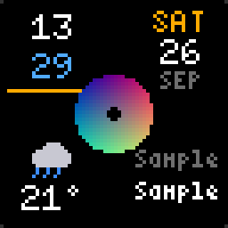

# Dashboard over DDP

`panel-ddp` is a Rust program that draws a dashboard for a 64×64 WLED matrix
and streams it to the board over DDP (Distributed Display Protocol, UDP port 4048), which
WLED listens on out of the box. Nothing is installed on the board: WLED shows
what arrives as realtime input and drops back to its presets a couple of
seconds after the stream stops, so the GIF playlist is the fallback whenever
the sender is off. The gap file applies to streamed frames too.
The screen is split into areas, laid out below. How DDP works and what it
cannot do is in [ddp.md](ddp.md).

## Layout

The screen is split into five regions, four tiles and a hub. By default:

| Region         | Origin   | Size  |
|----------------|----------|-------|
| `top_left`     | (2, 2)   | 24×24 |
| `top_right`    | (38, 2)  | 24×24 |
| `bottom_left`  | (2, 38)  | 24×24 |
| `bottom_right` | (38, 38) | 24×24 |
| `hub`          | (21, 21) | 22×22 |

`[regions]` moves and resizes them. A region given there takes `x`, `y`,
`width` and `height` in panel pixels, all four, and must fit the 64×64; one
left out keeps its default:

```toml
[regions]
hub = { x = 0, y = 34, width = 64, height = 30, z = -1 }
top_left = { x = 0, y = 0, width = 34, height = 34 }
```

Regions may overlap. They are drawn in ascending `z` (default 0), so a
higher one draws over a lower one; with the same `z` the order is
`top_left`, `top_right`, `bottom_left`, `bottom_right`, `hub`, which is how
the default hub sits over the tiles' inner corners. A region has no
background of its own, so it covers what is below only where it draws: the
hub's disc hides the tiles under it, the corners around the disc do not.

A tile lays its content out for 24 pixels of height, centred in a taller or
shorter region, and takes the region's width: the clock's ring is the
largest circle that fits, text is centred and fitted to the width, the
progress bar spans it. Fonts do not scale, and what does not fit is clipped
to the region. The hub's art is decoded at the hub's size and its disc is
the largest circle that fits.

Each corner shows one tile, the hub one of its own kinds. A clock-and-weather
panel needs no account at all; the rest switch on with a table in the config.

No source needed:

- `clock` — hours over minutes inside a seconds ring, advanced once a
  second: `seconds = "dot"` (the default) moves a dot of `dot_size` ring
  pixels (default 2) round it like a second hand, `seconds = "ring"` fills
  it clockwise from twelve.
- `date` — weekday, day of month, month.
- `blank`

With `[weather]`, which is just a location:

- `weather` — sky icon and temperature from Open-Meteo, no key needed.

With `[spotify]`, or a Home Assistant media player:

- `now_playing` — artist and title, scrolling when wider than the tile, blank
  while nothing plays.
- hub `media` — the album art in the hub instead of the background, dimmed
  while paused, a faint ripple when nothing plays. `shape` is `disc` (a
  record with a spindle hole, the default), `square` (the whole cover) or
  `faded` (the whole cover with the corners outside the circle dimmed);
  `spin = true` turns it while playing.

With `[home_assistant]`:

- `sensor` — one entity: label, value, unit. A numeric value loses decimals,
  then switches to the small font, to fit four characters.
- `progress` — one entity as a label, the value with its unit beside it, and
  a bar along the bottom edge that is full at `max` (default 100), amber on
  the way and green when full.

The hub also takes `blank`.

The art shows in one place. By default it is the `background`: the cover
across the whole panel behind the tiles, blended over black at `alpha`
(default 0.12) so they stay legible, and nothing else done to it. A hub set
to `media` moves it there and leaves the background black. Setting both is
refused; `background = { kind = "none" }` shows no art at all, and
`background = { kind = "frame", alpha = 0.12 }` puts the `[frame]` pictures
behind the tiles instead, one after another at `[frame].seconds` each.



### Just the art

Every tile and the hub `blank`, and the background at full brightness, turn
the panel into a cover display: the current album fills the center of the
display and nothing is drawn over it. Paused playback still dims it. As a second config
next to the dashboard, sharing the same Spotify app and token file:

```toml
target = "wled.local"

[spotify]
client_id = "..."

[tiles]
top_left = { kind = "blank" }
top_right = { kind = "blank" }
bottom_left = { kind = "blank" }
bottom_right = { kind = "blank" }
hub = { kind = "blank" }
background = { kind = "media", alpha = 1.0 }
```

```sh
target/release/panel-ddp run --config dashboard-art.toml
```

The same shape with a Home Assistant media player instead of Spotify: the
`[home_assistant]` table with `media_player` in place of `[spotify]`.

## Building

The crate pins its toolchain in `rust-toolchain.toml`; rustup installs
it on the first `cargo` run inside this repository and it applies only there. The
machine default (1.81 at the time of writing) cannot parse the manifests of
current crates.

```sh
cargo build --release
```

## Installing

The sender needs only the network: it can live on a Raspberry Pi next to
the panel or run in the background on a laptop. Relative paths in a config
(`gaps`, the token file, `art-cache`, `frame`) resolve against the config's
own folder, so a service only has to pass `--config` with an absolute path.

### Raspberry Pi

Cross-compile on the laptop rather than building on the Pi. `ring` (under
`rustls`) compiles C, so the target needs a C cross-compiler;
[cargo-zigbuild](https://github.com/rust-cross/cargo-zigbuild) uses Zig for
that and needs no Docker. For 64-bit Raspberry Pi OS:

```sh
brew install zig
cargo install --locked cargo-zigbuild
rustup target add aarch64-unknown-linux-gnu   # inside the repo: adds it to the pinned toolchain
cargo zigbuild --release --target aarch64-unknown-linux-gnu.2.31
# -> target/aarch64-unknown-linux-gnu/release/panel-ddp
```

The `.2.31` suffix links against glibc 2.31, so the binary runs on Bullseye
and later. On 32-bit Raspberry Pi OS use `armv7-unknown-linux-gnueabihf`
instead. [cross](https://github.com/cross-rs/cross)
(`cross build --release --target aarch64-unknown-linux-gnu`) does the same
through Docker.

Copy the binary, the config and any token file over (the gap file is only
for previews):

```sh
ssh pi mkdir -p panel-ddp
scp target/aarch64-unknown-linux-gnu/release/panel-ddp \
    dashboard.toml spotify-token.json pi:panel-ddp/
```

Do `spotify-login` on the laptop, where a browser can reach the redirect,
and copy the token file; from then on the Pi rewrites it as Spotify rotates
it. Run it as a systemd service, `/etc/systemd/system/panel-ddp.service`:

```ini
[Unit]
Description=panel-ddp dashboard
Wants=network-online.target
After=network-online.target

[Service]
User=pi
ExecStart=/home/pi/panel-ddp/panel-ddp run --config /home/pi/panel-ddp/dashboard.toml
KillSignal=SIGINT
Restart=on-failure
RestartSec=10

[Install]
WantedBy=multi-user.target
```

```sh
sudo systemctl daemon-reload
sudo systemctl enable --now panel-ddp
journalctl -u panel-ddp -f          # the log
```

`KillSignal=SIGINT` makes `systemctl stop` end the run the way Ctrl-C does,
so it tidies up.

### In the background on a laptop

On macOS a launchd agent keeps it running while logged in,
`~/Library/LaunchAgents/panel-ddp.plist` (use absolute paths; launchd does
not expand `~`):

```xml
<?xml version="1.0" encoding="UTF-8"?>
<!DOCTYPE plist PUBLIC "-//Apple//DTD PLIST 1.0//EN" "http://www.apple.com/DTDs/PropertyList-1.0.dtd">
<plist version="1.0">
<dict>
  <key>Label</key><string>panel-ddp</string>
  <key>ProgramArguments</key>
  <array>
    <string>/path/to/panel-ddp/target/release/panel-ddp</string>
    <string>run</string>
    <string>--config</string>
    <string>/path/to/panel-ddp/dashboard.toml</string>
  </array>
  <key>RunAtLoad</key><true/>
  <key>KeepAlive</key><true/>
  <key>StandardErrorPath</key><string>/tmp/panel-ddp.log</string>
</dict>
</plist>
```

```sh
launchctl bootstrap gui/$(id -u) ~/Library/LaunchAgents/panel-ddp.plist
launchctl bootout gui/$(id -u)/panel-ddp     # stop it
```

On a Linux laptop, the systemd unit above works as a user service
(`~/.config/systemd/user/`, without `User=`, `WantedBy=default.target`,
managed with `systemctl --user`). For a one-off, `nohup
target/release/panel-ddp run > panel-ddp.log 2>&1 &` is enough.

## Configuration

Copy `dashboard.example.toml` to `dashboard.toml` (git-ignored; it
holds the Home Assistant token) and edit. `target` is the board, the rest is
optional:

- `gamma` (default 2.2) — applied to pictures before they are sent. WLED
  gamma-corrects its own effects and GIFs but not streamed frames, and the
  HUB75 build defines `NO_CIE1931` so the driver is linear too, so an sRGB
  cover sent raw comes out washed out. Set 1.0 if the board's realtime gamma
  correction is switched on instead. The tiles' own colours are sent as they
  are; they were chosen on the panel.
- `temperature` (default `fahrenheit`, or `celsius`) — the unit for every
  temperature shown: the weather, and any sensor whose reading is in
  degrees, converted when Home Assistant reports the other unit.
- `gaps` (default `2d-gaps.json`) — a copy of the board's WLED gap file (one
  value per pixel, 1 for shown), used only by `preview` to grey out the
  pixels the panel hides. Without it the preview shows the whole 64×64.
  `2d-gaps.json` is git-ignored; `2d-gaps.example.json` is a sample that
  hides the four corners.
- `[weather]` — latitude, longitude, `refresh_minutes`, and `units` to
  override `temperature` for the weather tile alone.
- `[spotify]` — `client_id`, and optionally `token_file` (default
  `spotify-token.json` next to the config) and `refresh_seconds`. See below.
- `[art_cache]` — `dir` (default `art-cache` next to the config),
  `max_megabytes` (default 4; 0 disables) and `keep_originals` (default
  false). See below.
- `[home_assistant]` — `url`, a long-lived access `token` (profile page,
  Security tab), the `media_player` entity to use as the media source when
  there is no `[spotify]`, `refresh_seconds`.
- `[tiles]` — a tile per corner, one for the hub, and the `background`. A `sensor` tile names its
  `entity` and `label`, and may set `unit` (`""` hides it) and `decimals`. A
  `progress` tile names `entity` and `label`, and may set `max` and `decimals`.

Loading refuses a config whose tiles need a table it lacks. When both
`[spotify]` and a Home Assistant media player are set, Spotify feeds the hub.

## Colours

Every colour the tiles draw with has a role, and every role can be set in
the config as `#rrggbb` or `#rrggbbaa`. An alpha below `ff` blends the
colour over whatever is already on the panel at that spot, the background
art or black, so a translucent track lets the cover show through it. The
roles and their defaults, which are the values the tiles were tuned with:

| role          | default   | used for                                           |
|---------------|-----------|----------------------------------------------------|
| `text`        | `#ffffff` | hours, the day, sensor readings, the title         |
| `label`       | `#6e6e6e` | labels, units, the month, the artist, a bar's frame |
| `track`       | `#2d2d2d` | the unfilled seconds ring, an empty bar, `--`      |
| `accent`      | `#ffaa00` | the weekday, the seconds fill, a bar on its way    |
| `secondary`   | `#50aaff` | the minutes                                        |
| `full`        | `#3cdc5a` | a bar at its maximum                               |
| `sun`         | `#ffaa00` | the sun, and lightning                             |
| `moon`        | `#dcdcb4` | the moon                                           |
| `cloud`       | `#c8c8d2` | clouds                                             |
| `storm_cloud` | `#78788c` | the storm cloud                                    |
| `rain`        | `#3c8cff` | rain                                               |
| `snow`        | `#ffffff` | snow                                               |
| `fog`         | `#6e6e6e` | fog                                                |

`[colors]` sets a role for every tile; a tile's own `colors` sets it for
that tile alone and wins. The seconds ring's track at a quarter alpha, and
green minutes, on the clock only:

```toml
[colors]
accent = "#ff4060"

[tiles]
top_left = { kind = "clock", colors = { track = "#ffffff40", secondary = "#80ff80" } }
```

The hub's `media` kind has two alphas of its own, `paused_alpha` (default
0.4) for the art while paused and `corner_alpha` (default 0.3) for the
corners of the faded shape; the background has its `alpha`.

## Picture frame

`panel-ddp frame` shows the pictures in a folder one after another, filling
the panel with nothing drawn over them, each cropped to
square, scaled to the panel and gamma-corrected like album art. It loops
until Ctrl-C, or `--once` plays the folder through once. The folder and
pacing are in `[frame]`, with these defaults:

```toml
[frame]
dir = "frame"        # relative to the config; .jpg, .jpeg and .png files
seconds = 10.0       # each picture
shuffle = false      # random order, reshuffled at each start; else by file name
alpha = 1.0
```

Pictures with a bright subject on black suit the panel best. `frame/` is
git-ignored; keep a note of where each picture came from and its licence
beside them, as the `SOURCES.md` written there does.

## Pages and the demo

A config can hold `pages`: layouts shown one after another, each for its
own `seconds`, looping. With any pages, `run` shows them instead of
`[tiles]`, and `--once` plays them through a single time. A page takes the
same `top_left` … `bottom_right`, `hub` and `background` as `[tiles]`, except
that unnamed tiles are blank and the background is none unless given.

A page's `data` lays made-up values over whatever the sources report, for
demos and for pinning a page to something no source provides:

- `weather = { code, is_day, temperature }` — a WMO code, in the configured
  temperature unit.
- `sensors = { "sensor.x" = { state = "29", unit = "°C" } }`, or
  `{ sweep = [0, 100] }` to move the value linearly across the page. An
  alert's entity set to its state raises the alert.
- `cover = N` — the Nth newest cover in the art cache, playing. With
  `keep_originals`, only covers with an original count.
- `picture = N` — the Nth `[frame]` picture, for a `frame` background.

A page naming a cover or picture that is not there is left out, with a note.

`demo.json` is the demo built this way, in JSON, which loads like TOML:
the date alone touring the tiles, the clock joining, every kind of sky, the
print progress filling, the laundry temperature in its place, the water leak
alert, the whole dashboard plain, a cover in the hub, the dashboard over
each cover, the covers alone, frame pictures full screen, and the dashboard
over them. Its timings, labels and order are all in the file. Its `target`
is the WLED-AP address; point it at a board with `--target`:

```sh
target/release/panel-ddp run --config demo.json --target wled.local          # loops
target/release/panel-ddp run --config demo.json --target wled.local --once   # one pass
```

`art_file`, a top-level setting, keeps a JPEG at the album cover on show,
the original as downloaded, black when no cover is on, and removes it when
the run ends; `demo.json` sets it to `demo-art.jpg`. `art_open = true` runs
`open` on it after each change for macOS Preview. `tools/DemoArtViewer` is
a Processing sketch that follows the file without that.

## Alerts

An alert is a Home Assistant entity and the state that raises it. While
any alert is raised, the panel drops the tiles, pulses in the alert's colour
and shows its label in the middle, then returns to the dashboard when the
state clears. Any number of `[[alerts]]` tables; the first raised one wins:

```toml
[[alerts]]
entity = "binary_sensor.bathroom_water_leak"
state = "on"                # the default
label = "WATER LEAK"        # up to four characters large in the hub, up to eleven small above it
color = "#ff1e1e"           # the default
pulse_seconds = 1.5         # the default
```

Alerts need `[home_assistant]`; their entities are polled with the sensors.
`preview --alert` renders one, and `run --sample` raises them for five
seconds of every thirty.

## Spotify

Spotify's API needs an app of your own, which takes a minute: at
developer.spotify.com/dashboard create an app: any name and description, the
redirect URI `http://127.0.0.1:8888/callback`, and under "Which API/SDKs are
you planning to use?" tick Web API only. Copy its Client ID into `[spotify]`.
Then log in once:

```sh
target/release/panel-ddp spotify-login        # --port N if 8888 is taken; register that URI instead
```

It opens Spotify's consent page (or prints the link), catches the redirect
on the local port, and writes the token file next to the config. The flow is
PKCE, so there is no client secret anywhere. Spotify rotates the refresh
token on every use, so the file is rewritten as the dashboard runs; keep it
private and out of version control (the crate's `.gitignore` covers the
default name). If it is lost, log in again.

## Running

```sh
target/release/panel-ddp run                        # dashboard.toml, until Ctrl-C
target/release/panel-ddp run --config other.toml --frames 100
target/release/panel-ddp run --sample                 # made-up data, sensors sweep 0..100: a demo of the layout
target/release/panel-ddp run --config demo.json --target <board>   # the demo; --once for a single pass
target/release/panel-ddp frame                        # the pictures in [frame].dir, looping; --once for one pass
target/release/panel-ddp preview --out preview.png  # one frame from sample data, mask applied
target/release/panel-ddp preview --weather-code 95  # check an icon (add 1000 for night)
target/release/panel-ddp preview --alert            # the alert view
target/release/panel-ddp test <board-ip>            # colour bars, ramp, counter, bouncing dot
target/release/panel-ddp render --config demo.json --out /tmp/r   # every frame's hash, no network
```

`render` draws what `run` would send, frame by frame, without sending it or
fetching anything: the clock starts at a fixed time (`--at`, seconds since
1970) and the data is empty, so pages bring their own, or made up with
`--sample`. A config without pages needs `--frames N`. It writes
`frames.txt`, one SHA-256 per frame, and a PNG of each frame named with
`--png N`. Rendering before and after a change and comparing the two lists
shows whether the change moved a single pixel.

Common patterns:

```sh
# One demo pass, then back to the live dashboard: --once makes the first
# command end, so the second takes over.
target/release/panel-ddp run --config demo.json --target <board> --once && \
  target/release/panel-ddp run --config dashboard.toml

# Stop whatever is streaming, from another terminal. Ctrl-C does the same in
# its own; either way the run ends cleanly and removes its art_file. The
# board falls back to its presets a couple of seconds later.
pkill -f "panel-ddp run"
```

Only one sender at a time: two streams to the same board fight over the
panel, so stop the running one before starting another.

Each source runs on its own thread with its own refresh interval and keeps the
last good reading, so a slow or dead service never stalls a frame. A failure is
logged once, when its message changes. Album art is fetched only when the
picture URL changes.

Decoded album art is cached on disk under `[art_cache].dir`, one file per
picture URL, gamma and hub size holding the hub-sized and panel-sized pixels, about 14 KB each,
so the default 4 MB cap holds a few hundred covers. A hit costs no download
and no decoding and makes the entry the newest; past the cap the oldest
files are deleted first. The directory is git-ignored under the crate.
With `keep_originals`, each picture is also kept as downloaded, as a `.jpg`
or `.png` file named `Artist - Album` when the source says what it is and by
the URL's hash otherwise, and Spotify is asked for its largest
size; the `art_file` is then written from
that at full size instead of the panel's pixels scaled up. Originals count
against the cap, a few tens of kilobytes each.

The sender uses an unconnected UDP socket on purpose: a connected one turns
the ICMP unreachable from a rebooting board into a send error, which would end
the stream. Unconnected, the frames are lost until the board is back.

## What to check on the panel

The `test` frame's bars should come out red, green, blue, white left to right.
Mirrored output is the panel config's Reversed flag, not the sender. On the
SM16380SH batch, confirm the S-PWM engine keeps up at 10 fps; the engine is
ours, not the library's, and a full-frame rewrite ten times a second is more
than the GIF presets ask of it.
