# Demos

A config for each thing the panel can show, to look at and to copy from.
Each runs as it is, with no accounts; the pictures are the program's own
previews, four times the panel's 64×64 pixels.

```sh
target/release/panel-ddp preview --config docs/demos/tables.yaml --all-in-one --out preview.gif   # without a board
target/release/panel-ddp run --config docs/demos/tables.yaml --target <board> --once  # on one
```

Paths in a config are relative to it, so the demos name the gap file, the
art cache and the pictures as `../../…`: those stay at the top of the
repository.

## The tour

| `demo.yaml` |
|---|
| 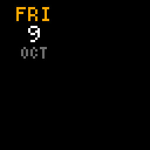 |

One tile, then the whole dashboard: the `date` touring the corners, the
`clock` joining it, the `weather` under every kind of sky, a `progress` bar
filling, a `sensor` reading, and an alert. With covers in the art cache and
pictures in `frame/` it goes on to the `art` and `picture` tiles, alone and
behind the dashboard.

## A wider panel

| `demo-128x64.yaml` |
|---|
| 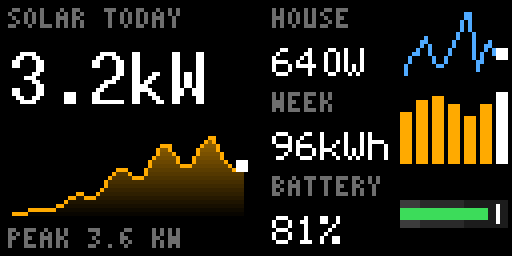 |

For a 128×64 panel (`width` and `height` in the config), three dashboards
that use the whole width: a reading over an area chart beside a table of
readings, a table with a line chart, a bar chart and a bullet chart on each
row of its data, and a reading beside its day over a month of bars.

## The starting point

| `dashboard.example.yaml` |
|---|
| 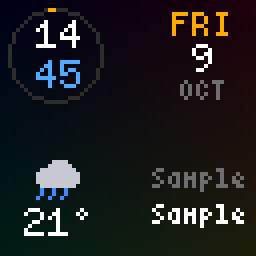 |

`dashboard.example.yaml`, at the top of the repository, is the config to
copy and edit: the weather, Home Assistant and Spotify as sources, a day
and a night playlist and a schedule. Its three pages, `home`, `music` and
`night`, are drawn here on sample data, since it needs accounts to run.

## Tile kinds

### Text

| `text.yaml` |
|---|
| 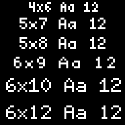 |

Every size a `text` tile comes in, from `4x6` to `10x20`, each line in its
own size and saying which, then lines too wide for the panel, scrolling.

The other kinds (`clock`, `date`, `weather`, `sensor`, `progress`, `art`,
`picture`) are in the tour.

## Chart kinds

| `line-charts.yaml` | `area-charts.yaml` | `bar-charts.yaml` | `bullet-charts.yaml` |
|---|---|---|---|
|  | 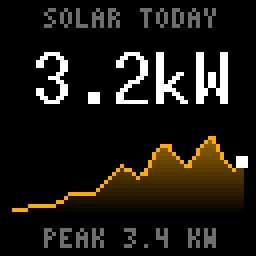 | 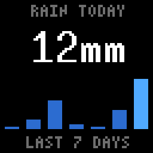 | 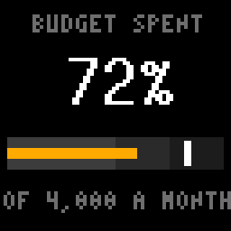 |

- **Line charts**, `line_chart`: a reading over its day, three readings
  with theirs beside them, one under the clock, and text over a chart the
  size of the panel. The line in a colour of its own, a dot of another on
  the latest value.
- **Area charts**, `area_chart`: the same line over a filled area, in the
  line's colour faded, a colour of its own, or a gradient.
- **Bar charts**, `bar_chart`: a week of wide bars under a reading, then
  bars one, two and four pixels wide, the latest in its own colour.
- **Bullet charts**, `bullet_chart`: a bar along a scale, over bands that
  say how good it is, with a marker at the target; one under a reading,
  then a table of them with the value and the target from data.

[../charts.md](../charts.md) has every setting of each.

## Tables

| `tables.yaml` |
|---|
| 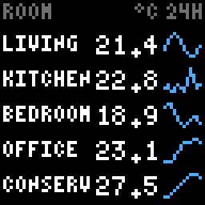 |

Rows of a height, each with tiles placed from the row's corner: names set
left and cut short, numbers set right, a chart on the end. The first table
has a row for each row of its data; the second has three fixed rows, each
a name over its value beside a chart.

## Data sources

The demos above bring their own values, as page `data`: made-up series and
rows written in the file. These three get theirs while running.

### Pushed over HTTP

| `http.yaml` |
|---|
| 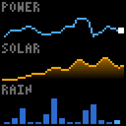 |

`http.yaml` draws what another program pushes to it: three charts, and a
table with a line chart and a bar chart on each row. `http-push.sh` is that
program at its smallest, a `cat` of some JSON piped to `curl` for each
series and for the table's rows; `tools/push_example.py` does the same from
Python, again and again with new values.
[../pushing-data.md](../pushing-data.md) is the guide.

```sh
target/release/panel-ddp run --config docs/demos/http.yaml --target <board>
sh docs/demos/http-push.sh               # in another terminal
```

### A command: SQL queries

| `commands.yaml` |
|---|
| 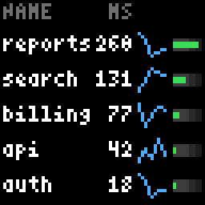 |

The panel runs `sqlite3 -json` on a timer and draws the rows: a table with
a line chart and a bullet chart on each row, a bar chart from a query, and
a bullet chart from `df`. The data is made up in memory, so it needs only
`sqlite3`; `duckdb -json` and `psql` are read the same way.

### A command: a script

| `uptime.yaml` |
|---|
| 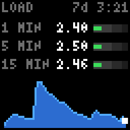 |

This machine's load, from `uptime`. `uptime.sh` turns what `uptime` prints
into JSON: the three load averages as a table's rows, how long the machine
has been up, and the one-minute load at each run as a series, which the
script keeps in a file since a command's series is replaced each time.

Data from a command, in [../dashboard.md](../dashboard.md), has the
settings.

## Drawing the pictures

```sh
cargo build --release
sh docs/demos/render.sh
```

`render.sh` draws them all again with `preview --all-in-one`, which goes
through every page of a config for its time, from copies of the demos in an
empty directory, so that this machine's gap file, covers and pictures are
not in them. `commands.png` and `uptime.png` are drawn with `--commands`,
which runs the config's commands once and draws what they print in place of
made-up values; `http.png` with `--push "sh http-push.sh"`, which serves
the config's endpoint while that command runs and draws what it pushed.

The moving ones are animated PNGs: in full colour, and smaller than a GIF.
`preview` writes one when the file is named `.apng`; `render.sh` renames
them `.png`, the name GitHub serves as a PNG, which a browser then
animates. A viewer that does not know them shows the first frame.
